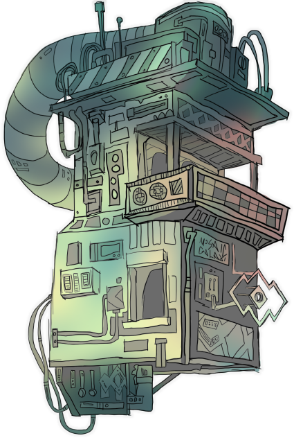

Blockchain technology has proven its long-term relevance,
creating new opportunities for a decentralized financial future
where individuals have full control over their assets. Our goal
is to assist in simplifying the process of entering the cryptocurrency
industry and opening the crypto space for the masses.

Additionally, our mission is to provide an ideal environment for DeFi
projects to thrive.

- Truly Decentralized
- Unique NFT-Based Validator System
- PoS / DPoS Consensus
- Opening Blockchain For The Masses

 

Mosaic Chain is developed upon Substrate, Polkadot’s blockchain builder SDK.
With this advanced technology underpinning Mosaic Chain’s consensus model,
anyone can participate as a validator, even without the need for extensive
technical expertise in running a blockchain validator.
